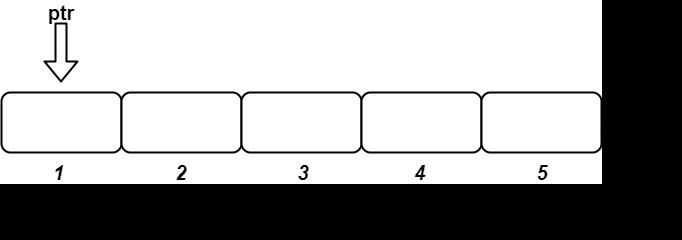

# Design an Ordered Stream
There is a stream of n pairs arriving in an arbitrary order. A pair consists of a unique ID and a value. 

The task is to design a stream that returns the values in increasing order of their IDs by returning a chunk of values after each insertion. The concatenation of all the chunks should result in a list of the sorted values.

# Example

```java
class OrderedStreamDesign {
	
	public static void main(String[] args){
		OrderedStream os = new OrderedStream();
		os.insert(3, "ccccc"); // []
		os.insert(1, "aaaaa"); // ["aaaaa"]
		os.insert(2, "bbbbb"); // ["bbbbb", "ccccc"]  
		os.insert(5, "eeeee"); // []  
		os.insert(4, "ddddd"); // ["ddddd", "eeeee"]
	}
}  

```

# Visual overview


